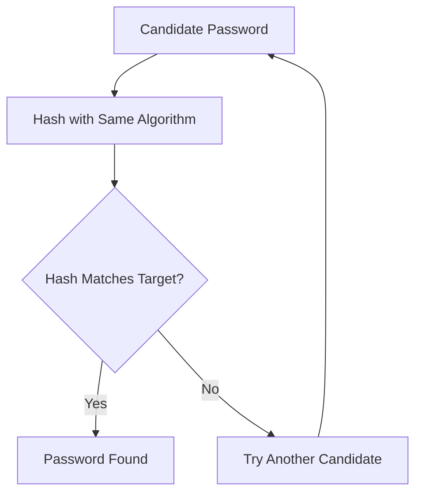

this one seems to be Ez one,so lets do it <br>

for the first 3 ones you need to do little search and copy pasting. <br>

the fourth one you need to know something first,the first 4 character of the hash,indicate that the hash is bcrypt ($2y$) and to know the value of it,you need to use the command of the **hashcat**,the command would be something simple but the options that u need are: <br>
  1- -m 3200 :telling the hashcat that use the bcrypt algorithm <br>
  2- -a 3 : meaning Mask attack,meaing I know something about the structure of the password, so don't try completely random possibilities <br>
  3- ?l?l?l?l :lowercase + lowercase + lowercase + lowercase,possible four-character lowercase passwords.<br>

  the command would be somehting like: <br>
  ```bash
hashcat -m 3200 -a 3 bcrypt.txt ?l?l?l?
```
be pacient with the process,it can take some time to give you the result.<br>

Meanwhile lets to a review: <br>
## 🔐 Understanding Password Hashes

A password hash is designed to be a **one-way function**. This means that if we have the hash of a password, we cannot simply reverse it to obtain the original password.

Instead, if an attacker obtains a password hash, they can attempt to discover the original password by **guessing possible passwords**.

### How does it work?

The process is:

1. Take a possible password.
2. Hash it using the same hashing algorithm.
3. Compare the resulting hash with the target hash.
4. If they match, the password has been found.
5. If they don't match, try another candidate.



Tools such as **Hashcat** automate this process by testing large numbers of password candidates.

### Why does password strength matter?

The stronger the password, the larger the number of possible guesses an attacker may need to test.

Password-hashing algorithms such as **bcrypt** are also deliberately computationally expensive, making each password guess slower and therefore making brute-force and dictionary attacks more difficult.

### ⚠️ Hashing ≠ Encryption

Hash cracking is **not the same as decrypting** a password hash.

You are not reversing the hash. Instead, you are:

> **Guessing a password → hashing the guess → comparing it with the target hash.**

If a candidate produces the same hash, you have found a password that corresponds to the target hash.<br>

the last one on Task1 would not be a trouble for you now.
<br>
<br>


Hashcat Hash Modes — 0–3000

Hashcat uses the -m option to specify the hash type / hash mode.

hashcat -m <MODE> <HASH> <WORDLIST>

Note: Hashcat mode numbers are not sequential. The table below contains the commonly used modes in the 0–3000 range rather than every unused mode number.

Mode	Hash Type
0	MD5
10	md5($pass.$salt)
11	Joomla < 1.5
12	PostgreSQL
20	md5($salt.$pass)
21	osCommerce, xt
22	Juniper NetScreen/SSG (ScreenOS)
23	Skype
24	SolarWinds Orion
25	WPA-EAPOL-PBKDF2
30	md5(utf16le($pass))
40	md5($pass.$salt.$pass)
50	HMAC-MD5 (key = $pass)
60	HMAC-MD5 (key = $salt)
70	md5(utf16le($pass).$salt)
80	md5($salt.md5($pass))
90	md4(utf16le($pass))
100	SHA-1
110	sha1($pass.$salt)
120	sha1($salt.$pass)
130	sha1($salt.$pass.$salt)
140	sha1($salt.md5($pass))
150	HMAC-SHA1 (key = $pass)
160	HMAC-SHA1 (key = $salt)
170	sha1(utf16le($pass).$salt)
200	MySQL323
300	MySQL4.1/MySQL5
400	phpass, WordPress (MD5), phpBB3
500	md5crypt, Cisco-IOS $1$
900	MD4
1000	NTLM
1100	Domain Cached Credentials (DCC), MS Cache
1300	SAP CODVN B
1400	SHA-256
1500	descrypt, Traditional DES
1600	Apache $apr1$
1700	SHA-512
1800	sha512crypt, SHA-512 (Unix)
2000	STDOUT
2100	Domain Cached Credentials 2 (DCC2), MS Cache 2
2400	Cisco-PIX (MD5)
2500	WPA-EAPOL-PBKDF2
2600	md5(md5($pass))
3000	L

**Task2**


