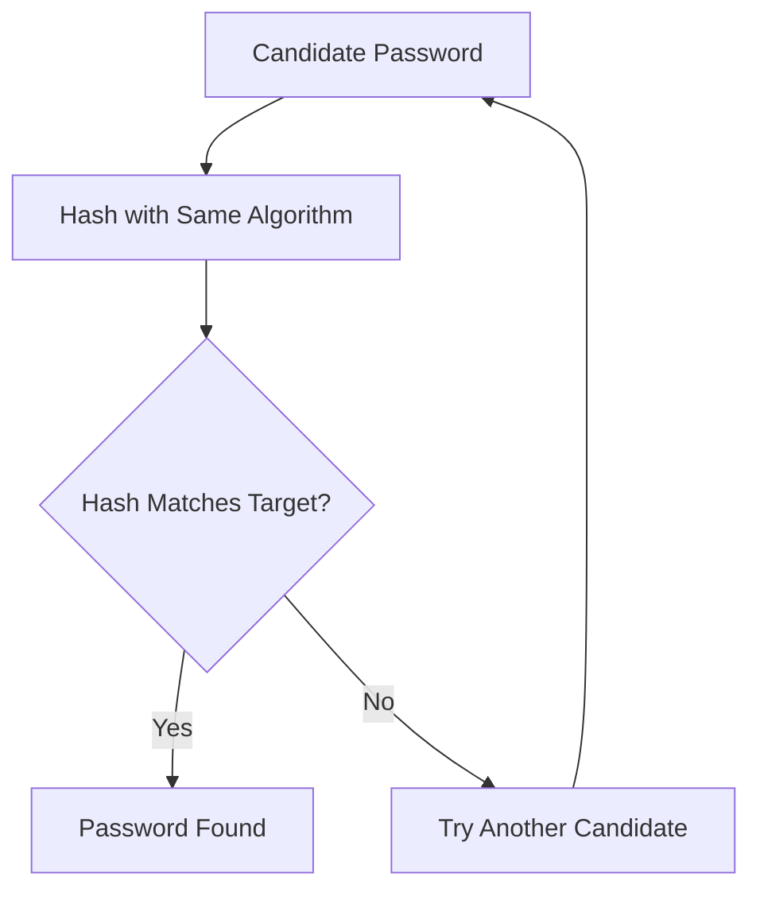

this one seems to be Ez one,so lets do it <br>

for the first 3 ones you need to do little search and copy pasting. <br>

the fourth one you need to know something first,the first 4 character of the hash,indicate that the hash is bcrypt ($2y$) and to know the value of it,you need to use the command of the **hashcat**,the command would be something simple but the options that u need are: <br>
  1- -m 3200 :telling the hashcat that use the bcrypt algorithm <br>
  2- -a 3 : meaning Mask attack,meaing I know something about the structure of the password, so don't try completely random possibilities <br>
  3- ?l?l?l?l :lowercase + lowercase + lowercase + lowercase,possible four-character lowercase passwords.<br>

  the command would be somehting like: <br>
  ```bash
hashcat -m 3200 -a 3 bcrypt.txt ?l?l?l?
```
be pacient with the process,it can take some time to give you the result.<br>

Meanwhile lets to a review: <br>
## 🔐 Understanding Password Hashes

A password hash is designed to be a **one-way function**. This means that if we have the hash of a password, we cannot simply reverse it to obtain the original password.

Instead, if an attacker obtains a password hash, they can attempt to discover the original password by **guessing possible passwords**.

### How does it work?

The process is:

1. Take a possible password.
2. Hash it using the same hashing algorithm.
3. Compare the resulting hash with the target hash.
4. If they match, the password has been found.
5. If they don't match, try another candidate.



Tools such as **Hashcat** automate this process by testing large numbers of password candidates.

### Why does password strength matter?

The stronger the password, the larger the number of possible guesses an attacker may need to test.

Password-hashing algorithms such as **bcrypt** are also deliberately computationally expensive, making each password guess slower and therefore making brute-force and dictionary attacks more difficult.

### ⚠️ Hashing ≠ Encryption

Hash cracking is **not the same as decrypting** a password hash.

You are not reversing the hash. Instead, you are:

> **Guessing a password → hashing the guess → comparing it with the target hash.**

If a candidate produces the same hash, you have found a password that corresponds to the target hash.<br>

the last one on Task1 would not be a trouble for you now.
<br>
<br>

quick tip,better to check this page before the next task [Hashcat](https://hashcat.net/wiki/doku.php?id=example_hashes) <br>


**Task2**😎

2-1when you search it on the online tools,not gonna show u the result you want,but maybe if you pay attention,you can find which hash methos is it using <br>

2-2:the seond one,After googling a bit, I understood it was NTLM hash.so as the command above,you only need to find the correct number of the mode which is :1000 <br>


2-3 This was a fun one. It helped me understand how **hashes are stored and identified**.

The first part of the hash, `$6$`, indicates the hashing algorithm being used. Earlier, in Level 1, Q4, we came across `$2y$`, which is commonly associated with **bcrypt**.

In this case, `$6$` represents **SHA-512 crypt**.

I also found that Hashcat has different **modes for different hashing algorithms**, which you can check out here:https://github.com/unstable-deadlock/brashendeavours.gitbook.io/blob/master/pentesting-cheatsheets/hashcat-hash-modes.md <br>

So I tried -m 1800 as it was close to the format that was given <br>

2-4: Password + Salt → Hash

```text
Password: ?
Salt:     tryhackme

        Password + "tryhackme"
                  │
                  ▼
                SHA-1
                  │
                  ▼
e5d8870e5bdd26602cab8dbe07a942c8669e56d6
```
The exact way the salt is combined depends on the application. It could be: SHA1(password + salt) or SHA1(salt + password) <br>

110 and 120 too left out as we only have salt and hash<br>

so the last option was -m 160.<br>

I hope you enjoy IT.


